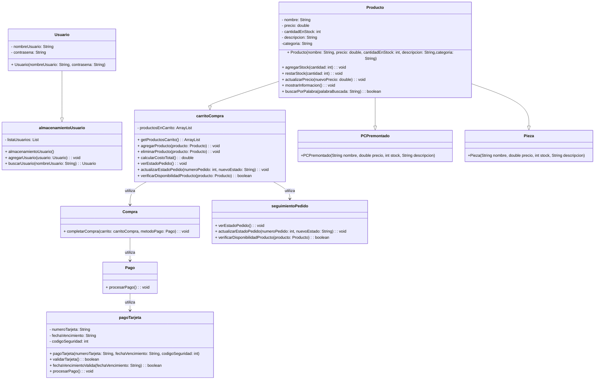

# TrabajoFinalTPA

Tienda online llamada Components Tech

## Desarrolladores
- Pedro Zuñeda Diego
- Pablo Torres Villar

## Descripción Funcionalidad

1. Tienda para comprar ordenadores premontados y piezas sueltas.
2. Opción de iniciar sesion y registrarte.
3. Poder ver lo que tengas en el carrito por si lo quieres comprar.
4. Buscador de productos.

Queda por añadir:

1. Los productos.
2. Opcion de atencion al cliente.
3. Teléfono de contacto.

## Patrón de diseño usado
-Diseño observer

## Diagrama UML

## Vistas

